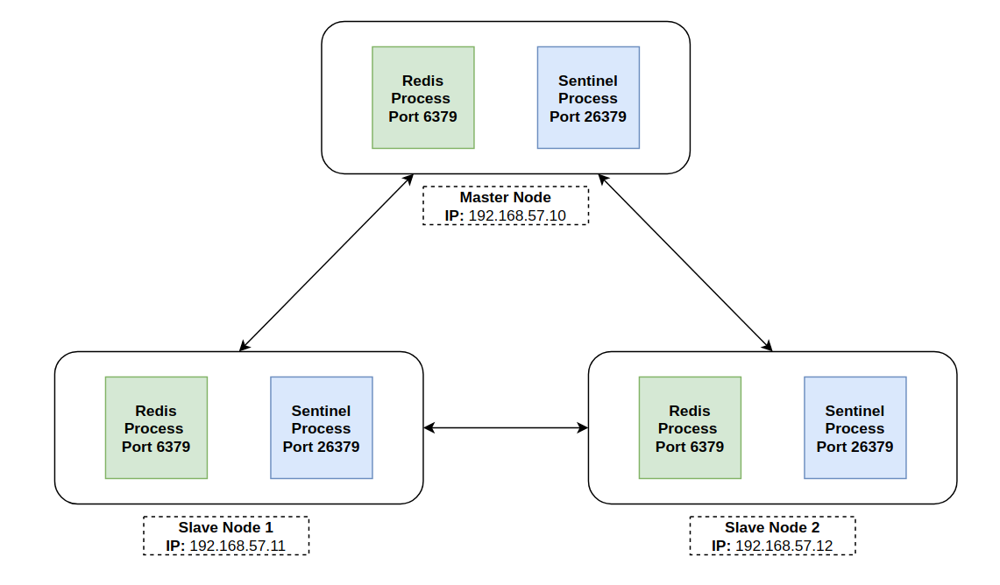

# labs-database
## Indexes

1. [Percona 5.7 - replicate GTID]()
2. [Mongodb replica set]()
3. [Redis Master-Slave (with High Availability)]()

## 1. Percona 5.7 - replicate GTID

## 2. Mongodb replica set

## 3. Redis Master-Slave with High Availability (Sentinel)
> Note: I will CentOS like a main OS in this lab.

### Topology


192.168.57.10 (Master Node)
192.168.57.11 (Slave Node)
192.168.57.12 (Slave Node)

### Install Redis
- Install Redis package via `yum` on 3 nodes

```bash
yum install redis
```

### Config Master-Slave on 3 Redis nodes
- On node Master

```bash
vim /etc/redis.conf
```

```
bind 192.168.57.10
port 6379

protected-mode no
requirepass "Password1"
masterauth "Password1"

tcp-keepalive 300
dir "/var/lib/redis"
logfile "/var/log/redis/redis.log"
```

- On node Slave 01

```bash
vim /etc/redis.conf
```

```
bind 192.168.57.11
port 6379

protected-mode no
requirepass "Password1"
masterauth "Password1"

slaveof 192.168.57.10 6379

tcp-keepalive 300
dir "/var/lib/redis"
logfile "/var/log/redis/redis.log"
```

- On node Slave 02

```bash
vim /etc/redis.conf
```

```
bind 192.168.57.12
port 6379

protected-mode no
requirepass "MwsxWAMtymiBetNI"
masterauth "MwsxWAMtymiBetNI"

slaveof 192.168.57.10 6379

tcp-keepalive 300
dir "/var/lib/redis"
logfile "/var/log/redis/redis.log"
```

Note: `slaveof` tells Redis cluster to make this particular server instance as a SLAVE instance of the given MASTER node.

### Config Sentinel to monitor 3 Redis nodes

- On 3 Redis nodes (one Master and 2 Slave nodes)

```bash
vim /etc/redis-sentinel.conf
```

```
protected-mode no
port 26379

sentinel monitor mymaster 192.168.57.10 6379 2

sentinel auth-pass mymaster MwsxWAMtymiBetNI

sentinel down-after-milliseconds mymaster 5000

sentinel failover-timeout mymaster 10000

logfile "/var/log/redis/sentinel.log"
```

`sentinel monitor mymaster 192.168.57.10 6379 2` - This tells sentinel to monitor the `master node` and the last argument which is `2` is the quorum value.

`sentinel down-after-milliseconds mymaster 5000` - Server will unresponsive for **5 seconds** before being classified as `+down` and consequently activating a `+vote` to elect a new master node.

`sentinel failover-timeout mymaster 10000` - Specifies the failover timeout in milliseconds.

- Start redis and redis-sentinel services on 3 Redis nodes

```bash
systemctl start redis
systemctl enable redis

systemctl start redis-sentinel
systemctl enable redis-sentinel
```

### Verify the Master/Slave Replication

Check redis log on 3 nodes
- On Master node
```bash
cat /var/log/redis/redis.log 
```

```
48294:M 05 Mar 14:51:47.492 # Server started, Redis version 3.2.12
48294:M 05 Mar 14:51:47.492 * DB loaded from disk: 0.000 seconds
48294:M 05 Mar 14:51:47.492 * The server is now ready to accept connections on port 6379
...
23928:M 05 Mar 13:57:03.931 * Slave 192.168.57.11:6379 asks for synchronization
23928:M 05 Mar 13:57:03.931 * Full resync requested by slave 192.168.57.11:6379
23928:M 05 Mar 13:57:03.972 * Synchronization with slave 192.168.57.11:6379 succeeded
...
23928:M 05 Mar 13:58:24.532 * Slave 192.168.57.12:6379 asks for synchronization
23928:M 05 Mar 13:58:24.532 * Full resync requested by slave 192.168.57.12:6379
23928:M 05 Mar 13:58:24.580 * Synchronization with slave 192.168.57.12:6379 succeeded
```

- On Slave nodes
```bash
cat /var/log/redis/redis.log
```

```
23267:S 05 Mar 13:57:03.926 # Server started, Redis version 3.2.12
23267:S 05 Mar 13:57:03.926 * The server is now ready to accept connections on port 6379
23267:S 05 Mar 13:57:03.927 * Connecting to MASTER 192.168.57.10:6379
...
23267:S 05 Mar 13:57:03.927 * MASTER <-> SLAVE sync started
23267:S 05 Mar 13:57:03.972 * MASTER <-> SLAVE sync: receiving 77 bytes from master
23267:S 05 Mar 13:57:03.972 * MASTER <-> SLAVE sync: Flushing old data
23267:S 05 Mar 13:57:03.972 * MASTER <-> SLAVE sync: Loading DB in memory
23267:S 05 Mar 13:57:03.972 * MASTER <-> SLAVE sync: Finished with success
```

Check replication status
- On Master node
```bash
redis-cli -h 192.168.57.10
192.168.57.10:6379> AUTH MwsxWAMtymiBetNI
192.168.57.10:6379> info replication
```

```
# Replication
role:master
connected_slaves:2
slave0:ip=192.168.57.11,port=6379,state=online,offset=377788,lag=1
slave1:ip=192.168.57.12,port=6379,state=online,offset=377788,lag=1
master_repl_offset:377929
repl_backlog_active:1
repl_backlog_size:1048576
repl_backlog_first_byte_offset:2
repl_backlog_histlen:377928
```

- On Slave nodes
```bash
redis-cli -h 192.168.57.11
192.168.57.11:6379> AUTH MwsxWAMtymiBetNI
192.168.57.11:6379> info replication
```

```
# Replication
role:slave
master_host:192.168.57.10
master_port:6379
master_link_status:up
master_last_io_seconds_ago:1
master_sync_in_progress:0
slave_repl_offset:374517
slave_priority:100
slave_read_only:1
connected_slaves:0
master_repl_offset:0
repl_backlog_active:0
repl_backlog_size:1048576
repl_backlog_first_byte_offset:0
repl_backlog_histlen:0
```

### Production performance optimizing tips and tricks
- Disable Transparent Huge Pages (THP) support
```bash
vim /etc/rc.local
```

```
echo never > /sys/kernel/mm/transparent_hugepage/enabled
```

- Increase TCP backlog settings
```bash
vim /etc/sysctl.conf
```

```
net.core.somaxconn=65535
```