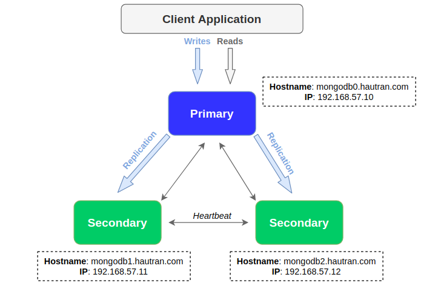

# labs-database
## Indexes

1. [Percona 5.7 - replicate GTID]()
2. [Mongodb replica set](#2-mongodb-replica-set)
3. [Redis Master-Slave (with High Availability)](#3-redis-master-slave-with-high-availability-sentinel)

## 1. Percona 5.7 - replicate GTID

## 2. Mongodb replica set
> Note: I will use CentOS like a main OS in this lab.

### Topology


### Install MongoDB
#### On 3 MongoDB nodes
- Add 3 `mongod` instances into `/etc/hosts`
```bash
vim /etc/hosts
```

```
192.168.57.10   mongodb0.hautran.com
192.168.57.11   mongodb1.hautran.com
192.168.57.12   mongodb2.hautran.com
```

- Add MongoDB Community Edition repository

```bash
vim /etc/yum.repos.d/mongodb.repo
```

```
[mongodb-org-4.2]
name=MongoDB Repository
baseurl=https://repo.mongodb.org/yum/redhat/$releasever/mongodb-org/4.2/x86_64/
gpgcheck=1
enabled=1
gpgkey=https://www.mongodb.org/static/pgp/server-4.2.asc
```

- Install MongoDB via `yum`

```bash
yum install mongodb-org -y
```

### Config MongoDB Replica Set
#### On 3 MongoDB nodes
- Change bindIP to `0.0.0.0` and set replica set name of MongoDB

```bash
vim /etc/mongod.conf
``` 

```
net:
  port: 27017
  bindIp: 0.0.0.0

replication:
  replSetName: "rs0"
```

- Start and set onboot MongoDB service

```bash
systemctl start mongod
systemctl enable mongod
```

#### On Primary MongoDB node
- Login in MongDB shell
```bash
mongo
```

Initiate the replica set

```
rs.initiate( {
   _id : "rs0",
   members: [
      { _id: 0, host: "mongodb0.hautran.com:27017" },
      { _id: 1, host: "mongodb1.hautran.com:27017" },
      { _id: 2, host: "mongodb2.hautran.com:27017" }
   ]
})
```

```
{
  "ok" : 1,
  "$clusterTime" : {
    "clusterTime" : Timestamp(1583685813, 1),
    "signature" : {
      "hash" : BinData(0,"AAAAAAAAAAAAAAAAAAAAAAAAAAA="),
      "keyId" : NumberLong(0)
    }
  },
  "operationTime" : Timestamp(1583685813, 1)
}
```

### Verify MongoDB Status

- View the replica set configuration

```
rs.conf()
```

The replica set configuration object resembles the following

```
{
    "_id" : "rs0",
    "version" : 1,
    "protocolVersion" : NumberLong(1),
    "writeConcernMajorityJournalDefault" : true,
    "members" : [
        {
            "_id" : 0,
            "host" : "mongodb0.hautran.com:27017",
            "arbiterOnly" : false,
            "buildIndexes" : true,
            "hidden" : false,
            "priority" : 1,
            "tags" : {
                
            },
            "slaveDelay" : NumberLong(0),
            "votes" : 1
        },
        {
            "_id" : 1,
            "host" : "mongodb1.hautran.com:27017",
            "arbiterOnly" : false,
            "buildIndexes" : true,
            "hidden" : false,
            "priority" : 1,
            "tags" : {
                
            },
            "slaveDelay" : NumberLong(0),
            "votes" : 1
        },
        {
            "_id" : 2,
            "host" : "mongodb2.hautran.com:27017",
            "arbiterOnly" : false,
            "buildIndexes" : true,
            "hidden" : false,
            "priority" : 1,
            "tags" : {
                
            },
            "slaveDelay" : NumberLong(0),
            "votes" : 1
        }
    ],
    "settings" : {
        "chainingAllowed" : true,
        "heartbeatIntervalMillis" : 2000,
        "heartbeatTimeoutSecs" : 10,
        "electionTimeoutMillis" : 10000,
        "catchUpTimeoutMillis" : -1,
        "catchUpTakeoverDelayMillis" : 30000,
        "getLastErrorModes" : {
            
        },
        "getLastErrorDefaults" : {
            "w" : 1,
            "wtimeout" : 0
        },
        "replicaSetId" : ObjectId("5e6520b5bc924e6438c05fd2")
    }
}
```

- Use `rs.status()` to identify the primary in the replica set.

```
> rs.status()
```

```
{
    "set" : "rs0",
    "date" : ISODate("2020-03-09T07:20:29.667Z"),
    "myState" : 1,
    "term" : NumberLong(3),
    "syncingTo" : "",
    "syncSourceHost" : "",
    "syncSourceId" : -1,
    "heartbeatIntervalMillis" : NumberLong(2000),
    "majorityVoteCount" : 2,
    "writeMajorityCount" : 2,
    "optimes" : {
        "lastCommittedOpTime" : {
            "ts" : Timestamp(1583738428, 1),
            "t" : NumberLong(3)
        },
        "lastCommittedWallTime" : ISODate("2020-03-09T07:20:28.856Z"),
        "readConcernMajorityOpTime" : {
            "ts" : Timestamp(1583738428, 1),
            "t" : NumberLong(3)
        },
        "readConcernMajorityWallTime" : ISODate("2020-03-09T07:20:28.856Z"),
        "appliedOpTime" : {
            "ts" : Timestamp(1583738428, 1),
            "t" : NumberLong(3)
        },
        "durableOpTime" : {
            "ts" : Timestamp(1583738428, 1),
            "t" : NumberLong(3)
        },
        "lastAppliedWallTime" : ISODate("2020-03-09T07:20:28.856Z"),
        "lastDurableWallTime" : ISODate("2020-03-09T07:20:28.856Z")
    },
    "lastStableRecoveryTimestamp" : Timestamp(1583738418, 1),
    "lastStableCheckpointTimestamp" : Timestamp(1583738418, 1),
    "electionCandidateMetrics" : {
        "lastElectionReason" : "electionTimeout",
        "lastElectionDate" : ISODate("2020-03-09T07:13:37.857Z"),
        "electionTerm" : NumberLong(3),
        "lastCommittedOpTimeAtElection" : {
            "ts" : Timestamp(0, 0),
            "t" : NumberLong(-1)
        },
        "lastSeenOpTimeAtElection" : {
            "ts" : Timestamp(1583732177, 1),
            "t" : NumberLong(2)
        },
        "numVotesNeeded" : 2,
        "priorityAtElection" : 1,
        "electionTimeoutMillis" : NumberLong(10000),
        "numCatchUpOps" : NumberLong(0),
        "newTermStartDate" : ISODate("2020-03-09T07:13:38.823Z"),
        "wMajorityWriteAvailabilityDate" : ISODate("2020-03-09T07:13:39.570Z")
    },
    "members" : [
        {
            "_id" : 0,
            "name" : "mongodb0.hautran.com:27017",
            "health" : 1,
            "state" : 1,
            "stateStr" : "PRIMARY",
            "uptime" : 428,
            "optime" : {
                "ts" : Timestamp(1583738428, 1),
                "t" : NumberLong(3)
            },
            "optimeDate" : ISODate("2020-03-09T07:20:28Z"),
            "syncingTo" : "",
            "syncSourceHost" : "",
            "syncSourceId" : -1,
            "infoMessage" : "",
            "electionTime" : Timestamp(1583738017, 1),
            "electionDate" : ISODate("2020-03-09T07:13:37Z"),
            "configVersion" : 1,
            "self" : true,
            "lastHeartbeatMessage" : ""
        },
        {
            "_id" : 1,
            "name" : "mongodb1.hautran.com:27017",
            "health" : 1,
            "state" : 2,
            "stateStr" : "SECONDARY",
            "uptime" : 421,
            "optime" : {
                "ts" : Timestamp(1583738428, 1),
                "t" : NumberLong(3)
            },
            "optimeDurable" : {
                "ts" : Timestamp(1583738428, 1),
                "t" : NumberLong(3)
            },
            "optimeDate" : ISODate("2020-03-09T07:20:28Z"),
            "optimeDurableDate" : ISODate("2020-03-09T07:20:28Z"),
            "lastHeartbeat" : ISODate("2020-03-09T07:20:28.924Z"),
            "lastHeartbeatRecv" : ISODate("2020-03-09T07:20:28.452Z"),
            "pingMs" : NumberLong(0),
            "lastHeartbeatMessage" : "",
            "syncingTo" : "mongodb0.hautran.com:27017",
            "syncSourceHost" : "mongodb0.hautran.com:27017",
            "syncSourceId" : 0,
            "infoMessage" : "",
            "configVersion" : 1
        },
        {
            "_id" : 2,
            "name" : "mongodb2.hautran.com:27017",
            "health" : 1,
            "state" : 2,
            "stateStr" : "SECONDARY",
            "uptime" : 413,
            "optime" : {
                "ts" : Timestamp(1583738418, 1),
                "t" : NumberLong(3)
            },
            "optimeDurable" : {
                "ts" : Timestamp(1583738418, 1),
                "t" : NumberLong(3)
            },
            "optimeDate" : ISODate("2020-03-09T07:20:18Z"),
            "optimeDurableDate" : ISODate("2020-03-09T07:20:18Z"),
            "lastHeartbeat" : ISODate("2020-03-09T07:20:28.830Z"),
            "lastHeartbeatRecv" : ISODate("2020-03-09T07:20:28.858Z"),
            "pingMs" : NumberLong(0),
            "lastHeartbeatMessage" : "",
            "syncingTo" : "mongodb0.hautran.com:27017",
            "syncSourceHost" : "mongodb0.hautran.com:27017",
            "syncSourceId" : 0,
            "infoMessage" : "",
            "configVersion" : 1
        }
    ],
    "ok" : 1,
    "$clusterTime" : {
        "clusterTime" : Timestamp(1583738428, 1),
        "signature" : {
            "hash" : BinData(0,"AAAAAAAAAAAAAAAAAAAAAAAAAAA="),
            "keyId" : NumberLong(0)
        }
    },
    "operationTime" : Timestamp(1583738428, 1)
}
```

### Enable Security Authentication (Optional)

- Using `openssl` to create a keyfile on `Primary` node

```bash
openssl rand -base64 756 > /opt/mongo/mongo-keyfile
chmod 400 /opt/mongo/mongo-keyfile
chown mongod:root /opt/mongo/mongo-keyfile
```

- Copy keyfile to `Secondary` nodes

```bash
scp /opt/mongo/mongo-keyfile root@mongodb1.hautran.com:/opt/mongo/
scp /opt/mongo/mongo-keyfile root@mongodb2.hautran.com:/opt/mongo/
```

- Edit MongoDB configuration to enable mode `authorization` and `keyfile` on 3 nodes
```bash
vim /etc/mongod.conf
```

```
security:
  authorization: enabled
  keyFile: /opt/mongo/mongo-keyfile
```

- Create the user administrator with `userAdminAnyDatabase` role on `Primary` node

```
rs0:PRIMARY> admin = db.getSiblingDB("admin")

rs0:PRIMARY> admin.createUser(
  {
    user: "admin",
    pwd: "rlDBl5LnAGVPobQS",
    roles: [{ 
        role: "userAdminAnyDatabase", 
        db: "admin" 
    }]
  }
)
```

- Create a user with `clusterAdmin` role on `Primary` node

That role could access the config and local databases, which are used in sharding and replication, respectively.

```
rs0:PRIMARY> admin = db.getSiblingDB('admin')

rs0:PRIMARY> admin.createUser(
  {
    user: "clusteradmin", 
    pwd: "RjWy73o71l9sOsoS", 
    roles: ["clusterAdmin"]
  }
)
```

- Restart MongoDB service on 3 nodes
```bash
systemctl restart mongod
```

- Verify the `authorization` mode after enabled
```bash
mongo
```

```
rs0:PRIMARY> db.getSiblingDB("admin").auth("clusteradmin", "RjWy73o71l9sOsoS")
rs0:PRIMARY> rs.status()
```

## 3. Redis Master-Slave with High Availability (Sentinel)
> Note: I will use CentOS like a main OS in this lab.

### Topology


### Install Redis
- Install Redis package via `yum` on 3 nodes

```bash
yum install redis
```

### Config Master-Slave on 3 Redis nodes
- On node Master

```bash
vim /etc/redis.conf
```

```
bind 192.168.57.10
port 6379

protected-mode no
requirepass "MwsxWAMtymiBetNI"
masterauth "MwsxWAMtymiBetNI"

tcp-keepalive 300
dir "/var/lib/redis"
logfile "/var/log/redis/redis.log"
```

- On node Slave 01

```bash
vim /etc/redis.conf
```

```
bind 192.168.57.11
port 6379

protected-mode no
requirepass "MwsxWAMtymiBetNI"
masterauth "MwsxWAMtymiBetNI"

slaveof 192.168.57.10 6379

tcp-keepalive 300
dir "/var/lib/redis"
logfile "/var/log/redis/redis.log"
```

- On node Slave 02

```bash
vim /etc/redis.conf
```

```
bind 192.168.57.12
port 6379

protected-mode no
requirepass "MwsxWAMtymiBetNI"
masterauth "MwsxWAMtymiBetNI"

slaveof 192.168.57.10 6379

tcp-keepalive 300
dir "/var/lib/redis"
logfile "/var/log/redis/redis.log"
```

Note: `slaveof` tells Redis cluster to make this particular server instance as a SLAVE instance of the given MASTER node.

### Config Sentinel to monitor 3 Redis nodes

- On 3 Redis nodes (one Master and 2 Slave nodes)

```bash
vim /etc/redis-sentinel.conf
```

```
protected-mode no
port 26379

sentinel monitor mymaster 192.168.57.10 6379 2

sentinel auth-pass mymaster MwsxWAMtymiBetNI

sentinel down-after-milliseconds mymaster 5000

sentinel failover-timeout mymaster 10000

logfile "/var/log/redis/sentinel.log"
```

`sentinel monitor mymaster 192.168.57.10 6379 2` - This tells sentinel to monitor the `master node` and the last argument which is `2` is the quorum value.

`sentinel down-after-milliseconds mymaster 5000` - Server will unresponsive for **5 seconds** before being classified as `+down` and consequently activating a `+vote` to elect a new master node.

`sentinel failover-timeout mymaster 10000` - Specifies the failover timeout in milliseconds.

- Start redis and redis-sentinel services on 3 Redis nodes

```bash
systemctl start redis
systemctl enable redis

systemctl start redis-sentinel
systemctl enable redis-sentinel
```

### Verify the Master/Slave Replication

Check redis log on 3 nodes
- On Master node
```bash
cat /var/log/redis/redis.log 
```

```
48294:M 05 Mar 14:51:47.492 # Server started, Redis version 3.2.12
48294:M 05 Mar 14:51:47.492 * DB loaded from disk: 0.000 seconds
48294:M 05 Mar 14:51:47.492 * The server is now ready to accept connections on port 6379
...
23928:M 05 Mar 13:57:03.931 * Slave 192.168.57.11:6379 asks for synchronization
23928:M 05 Mar 13:57:03.931 * Full resync requested by slave 192.168.57.11:6379
23928:M 05 Mar 13:57:03.972 * Synchronization with slave 192.168.57.11:6379 succeeded
...
23928:M 05 Mar 13:58:24.532 * Slave 192.168.57.12:6379 asks for synchronization
23928:M 05 Mar 13:58:24.532 * Full resync requested by slave 192.168.57.12:6379
23928:M 05 Mar 13:58:24.580 * Synchronization with slave 192.168.57.12:6379 succeeded
```

- On Slave nodes
```bash
cat /var/log/redis/redis.log
```

```
23267:S 05 Mar 13:57:03.926 # Server started, Redis version 3.2.12
23267:S 05 Mar 13:57:03.926 * The server is now ready to accept connections on port 6379
23267:S 05 Mar 13:57:03.927 * Connecting to MASTER 192.168.57.10:6379
...
23267:S 05 Mar 13:57:03.927 * MASTER <-> SLAVE sync started
23267:S 05 Mar 13:57:03.972 * MASTER <-> SLAVE sync: receiving 77 bytes from master
23267:S 05 Mar 13:57:03.972 * MASTER <-> SLAVE sync: Flushing old data
23267:S 05 Mar 13:57:03.972 * MASTER <-> SLAVE sync: Loading DB in memory
23267:S 05 Mar 13:57:03.972 * MASTER <-> SLAVE sync: Finished with success
```

Check replication status
- On Master node
```bash
redis-cli -h 192.168.57.10
192.168.57.10:6379> AUTH MwsxWAMtymiBetNI
192.168.57.10:6379> info replication
```

```
# Replication
role:master
connected_slaves:2
slave0:ip=192.168.57.11,port=6379,state=online,offset=377788,lag=1
slave1:ip=192.168.57.12,port=6379,state=online,offset=377788,lag=1
master_repl_offset:377929
repl_backlog_active:1
repl_backlog_size:1048576
repl_backlog_first_byte_offset:2
repl_backlog_histlen:377928
```

- On Slave nodes
```bash
redis-cli -h 192.168.57.11
192.168.57.11:6379> AUTH MwsxWAMtymiBetNI
192.168.57.11:6379> info replication
```

```
# Replication
role:slave
master_host:192.168.57.10
master_port:6379
master_link_status:up
master_last_io_seconds_ago:1
master_sync_in_progress:0
slave_repl_offset:374517
slave_priority:100
slave_read_only:1
connected_slaves:0
master_repl_offset:0
repl_backlog_active:0
repl_backlog_size:1048576
repl_backlog_first_byte_offset:0
repl_backlog_histlen:0
```

### Production performance optimizing tips and tricks
- Disable Transparent Huge Pages (THP) support
```bash
vim /etc/rc.local
```

```
echo never > /sys/kernel/mm/transparent_hugepage/enabled
```

- Increase TCP backlog settings
```bash
vim /etc/sysctl.conf
```

```
net.core.somaxconn=65535
```
